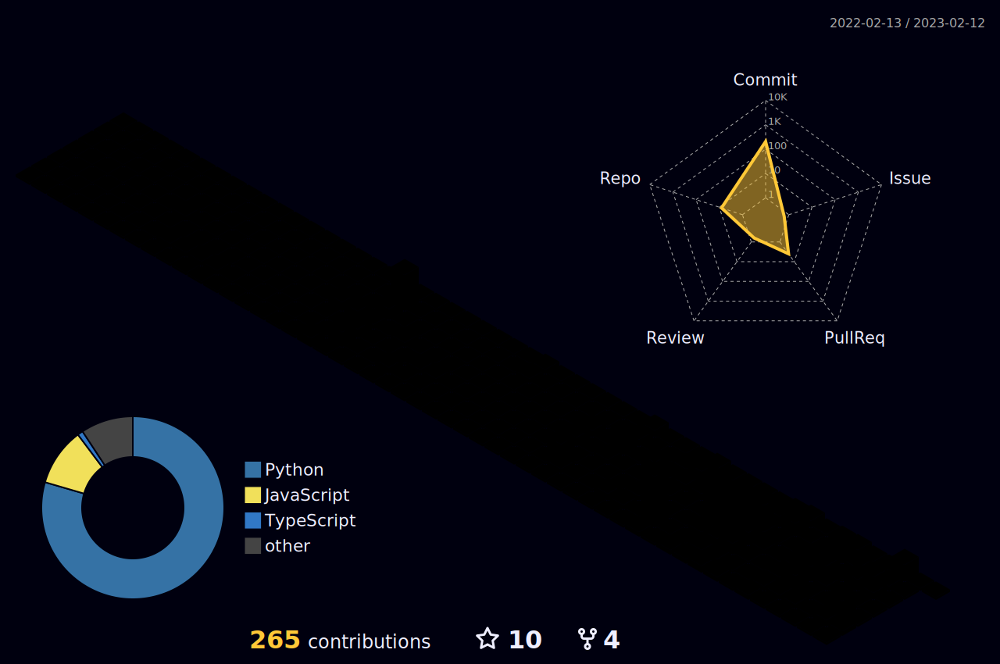

### Hi I'm Joseph👋

<!--

[<Badge Name>](https://img.shields.io/badge/<Badge Text>-<Background Color>?style=for-the-badge&logo=<Icon Name>&logoColor=<Logo Color>)-->

Here are some ideas to get you started:

- 🔭 I’m currently working on BWH1 and Edux
- 🌱 I’m currently learning how to build an Vertebrae Detection for CT scans
- 👯 I’m looking to collaborate on more Biomedical Software Engineering
- 💬 Ask me about my Hobbies!
- 📫 How to reach me: yoseple23@gmail.com
